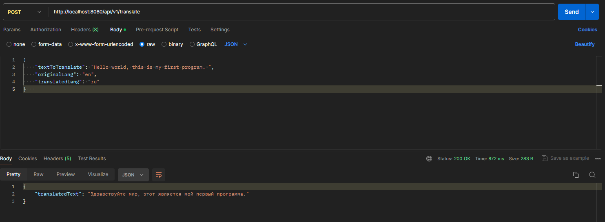

# Translator API

## Описание проекта

Это веб-приложение на языке Java для перевода набора слов с одного языка на другой, используя сторонний сервис перевода Яндекс Переводчик. Приложение обрабатывает перевод в многопоточном режиме, с ограничением на 10 одновременно работающих потоков, и сохраняет информацию о запросах в реляционную базу данных h2.

## Требования 

Для запуска приложения требуется Java Runtime версии 61.0 и выше
## Запуск приложения

1. **Клонируйте репозиторий:**

   ```bash
   git clone https://github.com/gw3nax/TranslationAPI
   ```
2. **Настройте сервис перевода:**

В application.yml добавьте конфигурацию для внешнего API:
   ```bash
    app:
      translator-url: https://translate.api.cloud.yandex.net/translate/v2/translate
      translator-api-key: insert_your_Yandex_API-KEY_here
   ```
Подробнее о работе API Yandex Translate можно почитать по следующей ссылке: https://yandex.cloud/ru/docs/translate/concepts/api

3. **Соберите проект:**
   ```bash
   mvn clean install
   ```
4. **Запустите приложение:**
   ```bash
   java -jar target/TranslationAPI-0.0.1-SNAPSHOT.jar
   ```
## Использование
   Для перевода строки, отправьте POST запрос на ```/api/v1/translate``` с телом запроса в формате JSON:
   ```json
{
    "textToTranslate": "Hello world, this is my first program",
    "originalLang": "en",
    "translatedLang": "ru"
}   
```
Вы можете это сделать в Postman так, как показано на скриншоте:


## Структура базы Данных

Таблица служит для записи данных о переводах и имеет следующий вид:
```sql
CREATE TABLE translations (
    id BIGINT AUTO_INCREMENT PRIMARY KEY,
    ip VARCHAR(45),
    original_text TEXT,
    translated_text TEXT
);
```


# Пример работы приложения
1. **Успешный перевод:**  

Запрос:
```json
{
    "textToTranslate": "Hello world, this is my first program",
    "originalLang": "en",
    "translatedLang": "ru"
}   
```
Ответ:
```json
{
    "translatedText": "Здравствуйте мир, этот является мой первый программа"
}
```
2. **Ошибка: Не найден язык исходного сообщения:**

Запрос:
```json
{
   "textToTranslate": "Hello world, this is my first program",
   "originalLang": "",
   "translatedLang": "ru"
}   
```
Ответ:
```json
{
   "timestamp": "2024-08-06T06:59:30.880+00:00",
   "status": 400,
   "error": "Bad Request",
   "message": "Не найден язык исходного сообщения",
   "path": "/api/v1/translate"
}
```
3. **Ошибка "Превышено количество запросов в секунду"**

Запрос:
```json
{
   "textToTranslate": "Hello world, this is my first program. Hello world, this is my first program. Hello world, this is my first program. Hello world, this is my first program. Hello world, this is my first program. Hello world, this is my first program. Hello world, this is my first program. Hello world, this is my first program. Hello world, this is my first program. ",
   "originalLang": "en",
   "translatedLang": "ru"
}   
```
Ответ:
```json
{
   "timestamp": "2024-08-06T07:03:17.313+00:00",
   "status": 400,
   "error": "Bad Request",
   "message": "java.util.concurrent.ExecutionException: main.translationapi.exception.TooManyRequestsException: Клиент превысил лимит запросов.\n",
   "path": "/api/v1/translate"
}
```
## Тестирование
В связи с нехваткой времени, был реализован всего один тест, проверяющий правильность перевода текста. Посмотреть его можно в папке ```test/java/main/translationapi```

